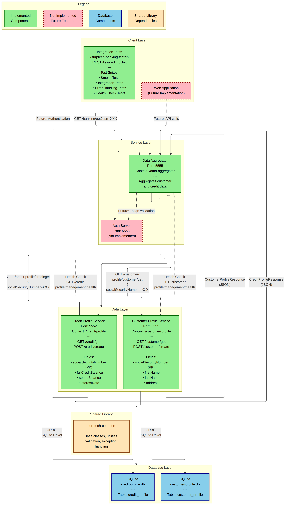

# SurpTech Banking System

A microservices-based banking system built with Java and Spring Boot on the backend and Next.js on the frontend. The system exposes customer personal and credit information through a layered service architecture, with a dedicated integration testing infrastructure and CI/CD workflows.

## System Architecture



The diagram source is maintained as a Mermaid file at [`wiki/architecture/architecture-diagram.mmd`](wiki/architecture/architecture-diagram.mmd). A GitHub Actions workflow recompiles it to PNG automatically on every change to that file.

## Components

### Backend Services

| Component | Port | Context Path | Description |
|---|---|---|---|
| [data-aggregator](data-aggregator/README.md) | 5555 | `/data-aggregator` | API gateway. Aggregates customer and credit data from downstream services into a single response. |
| [customer-profile](customer-profile/README.md) | 5551 | `/customer-profile` | Stores and retrieves customer personal information (name, address). Backed by SQLite. |
| [credit-profile](credit-profile/README.md) | 5552 | `/credit-profile` | Stores and retrieves customer credit information (balances, interest rate). Backed by SQLite. |
| auth-server | 5553 | — | Authentication server. **Not yet implemented.** Token validation is currently a no-op. |

### Frontend

| Component | Port | Description |
|---|---|---|
| [surptech-frontend](surptech-frontend/README.md) | 3000 | Next.js web application. Allows users to look up customer banking information by SSN. Uses a server-side proxy to avoid CORS issues. |

### Shared Libraries

| Component | Description |
|---|---|
| [surptech-common](surptech-common/README.md) | Spring Boot auto-configured library. Provides base classes (`BaseProcedure`, `BaseController`, `BaseRequest`, `BaseResponse`), HTTP client builder, global exception handling, input validation utilities, and request/response logging. Required by all backend services. |
| [surptech-common-tester](surptech-common-tester/README.md) | Testing library. Provides base test classes, step execution framework, configuration loading, and Allure reporting integration. Required by all test suites. |

### Test Suites

| Component | Tests Against | Description |
|---|---|---|
| [surptech-banking-tester](surptech-banking-tester/README.md) | `data-aggregator` | End-to-end integration tests for the API gateway. Covers smoke, integration, error handling, and health check scenarios. |
| [customer-profile-tester](customer-profile-tester/README.md) | `customer-profile` | Integration tests for the customer profile service in isolation. Covers GET and POST endpoints across all test categories. |

## Prerequisites

**Backend:**
- Java 25
- Maven 3.8+

**Frontend:**
- Node.js 18+
- npm 9+

## Getting Started

### 1. Build Shared Libraries

These must be installed to the local Maven repository before any service or test suite can be built.

```bash
cd surptech-common
mvn clean install

cd ../surptech-common-tester
mvn clean install
```

### 2. Start Backend Services

Each service runs in its own terminal.

```bash
# Terminal 1
cd customer-profile
mvn spring-boot:run

# Terminal 2
cd credit-profile
mvn spring-boot:run

# Terminal 3
cd data-aggregator
mvn spring-boot:run
```

### 3. Start the Frontend

```bash
cd surptech-frontend
npm install
npm run dev
```

Open `http://localhost:3000` in your browser.

### 4. Verify Everything Is Running

```bash
curl http://localhost:5551/customer-profile/management/health
curl http://localhost:5552/credit-profile/management/health
curl http://localhost:5555/data-aggregator/management/health
curl "http://localhost:5555/data-aggregator/customer/info?socialSecurityNumber=123-45-6789"
```

## Seed Data

Both databases are pre-loaded with two records for development and testing. The SSNs are consistent across both services.

| SSN | Name | Address | Credit Balance | Spend Balance | Interest Rate |
|---|---|---|---|---|---|
| `123-45-6789` | James Smith | 456 Tailor Street, California, LA 56001 | $15,000 | $5,000 | 3.5% |
| `987-65-4321` | John Travolta | 123 West Street, New York, NY 875423 | $28,000 | $12,000 | 8.5% |

## Running Tests

```bash
# System integration tests (requires all three backend services running)
cd surptech-banking-tester
mvn clean test -P smoke

# Customer profile service tests (requires customer-profile running)
cd customer-profile-tester
mvn clean test -P smoke
```

See each tester's README for the full list of available suites and options.

### Allure Reports

```bash
cd surptech-banking-tester
mvn allure:serve

cd customer-profile-tester
mvn allure:serve
```

## CI/CD

Three GitHub Actions workflows are available, all triggered manually from the Actions tab.

| Workflow | File | Description |
|---|---|---|
| Run Integration Tests | `.github/workflows/run-tests.yml` | Builds all services, starts them, runs the selected test suite against `data-aggregator`. Uploads Allure and Surefire artifacts. |
| Run Customer Profile Tests | `.github/workflows/customer-profile-tests.yml` | Builds and starts `customer-profile`, runs the selected suite against it. |
| Compile Architecture Diagram | `.github/workflows/architecture-diagram.yml` | Regenerates `architecture-diagram.png` from the Mermaid source file using `mmdc`. Commits the result back to the repository. |

## Architectural Patterns

The backend services share a consistent set of patterns enforced by `surptech-common`.

**Procedure pattern** — Business logic lives in `BaseProcedure` subclasses, not in controllers. Controllers call `executeProcedure(new XxxProcedure(...))`. Procedures are instantiated with `new` and resolve Spring beans via `ApplicationContextProvider`.

**Repository abstraction** — Each data service defines a repository interface. The concrete implementation is selected at startup via the `database.type` property in a switch expression inside `RepositoryConfiguration`. Currently only `sqlite` is implemented, but the structure is ready for PostgreSQL or MySQL.

**Mapper pattern** — Static mapper classes convert between Request DTO → Entity → Response DTO. There is no bidirectional coupling between layers.

**Upsert pattern** — Both repositories check for an existing record before deciding between INSERT and UPDATE, since SQLite does not have a native upsert that fits the use case.

**Partial aggregation** — The `data-aggregator` returns a partial response if only one of the two downstream profiles exists for a given SSN. Missing fields are omitted from the JSON response.

**Auto-configuration** — `surptech-common` self-registers via `META-INF/spring/org.springframework.boot.autoconfigure.AutoConfiguration.imports`. No explicit import is needed in dependent services.

## Technology Stack

**Backend**

| Technology | Version |
|---|---|
| Java | 25 |
| Spring Boot | 4.0.6 |
| SQLite JDBC | 3.47.1.0 |
| Lombok | 1.18.46 |
| Maven | 3.8+ |

**Testing**

| Technology | Version |
|---|---|
| JUnit 5 (Jupiter) | 6.0.3 |
| REST Assured | 5.5.0 |
| Allure | 2.27.0 |
| Maven Surefire | 3.5.2 |
| AspectJ Weaver | 1.9.22.1 |

**Frontend**

| Technology | Version |
|---|---|
| Next.js | 14 |
| React | 18 |
| TypeScript | 5 |
| Tailwind CSS | 3 |
| Node.js | 18+ |

## Project Structure

```
surptech-banking/
├── surptech-common/              # Shared backend library
├── surptech-common-tester/       # Shared testing library
├── customer-profile/             # Customer Profile service
├── credit-profile/               # Credit Profile service
├── data-aggregator/              # Data Aggregator service (API gateway)
├── surptech-frontend/            # Next.js web application
├── surptech-banking-tester/      # Integration tests for data-aggregator
├── customer-profile-tester/      # Integration tests for customer-profile
├── wiki/                         # Architecture diagrams and documentation
├── .github/workflows/            # CI/CD workflows
└── README.md                     # This file
```

## Known Limitations

- **Auth server not implemented.** The `Authorization` header is accepted by `data-aggregator` but token validation always returns `true`. Port 5553 is reserved.
- **No Docker Compose.** Services must be started manually. Docker support is listed as a future improvement.
- **No unit tests.** All automated testing is done through external integration test suites. The services themselves have no unit test source files.
- **Type mismatch on financial fields.** `credit-profile` uses `BigDecimal` internally; `data-aggregator` maps those fields to `Double` in its aggregated response.
- **Cloud integration not wired.** The `surptech-frontend/cloud-integration/` directory contains skeleton code and documentation for Firebase, GCP Cloud Storage, and MongoDB, but none of it is connected to the running application.

## License

Copyright © 2026 SurpTech
